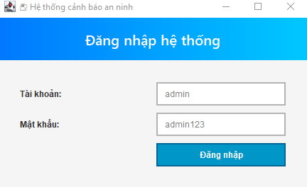
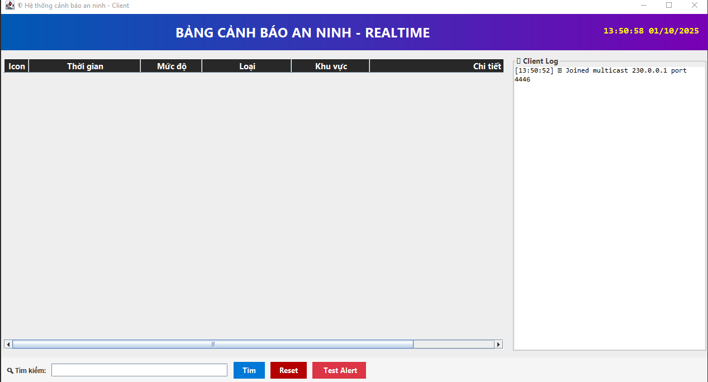
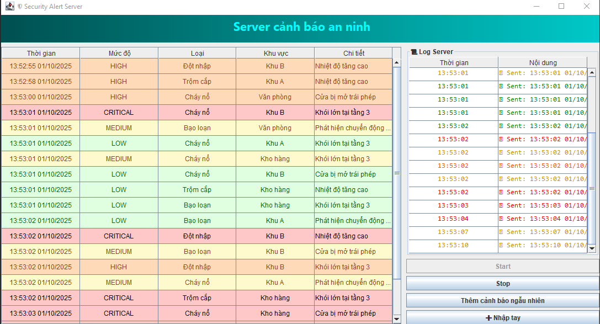
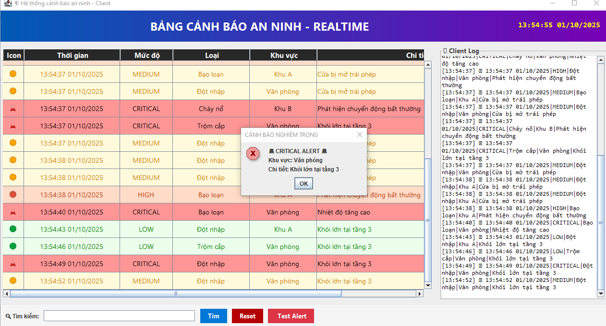

<h2 align="center">
    <a href="https://dainam.edu.vn/vi/khoa-cong-nghe-thong-tin">
    🎓 Faculty of Information Technology (DaiNam University)
    </a>
</h2>
<h2 align="center">
    HỆ THỐNG CẢNH BÁO THỜI GIAN THỰC (SERVER GỬI CẢNH BÁO TỚI NHIỀU CLIENT QUA UDP)
</h2>
<div align="center">
    <p align="center">
        
        
        
    </p>

[](https://www.facebook.com/DNUAIoTLab)
[](https://dainam.edu.vn/vi/khoa-cong-nghe-thong-tin)
[](https://dainam.edu.vn)

</div>


## 📖 1. Giới thiệu hệ thống

🖥️ Server

Server có nhiệm vụ phát sinh hoặc thu thập cảnh báo an ninh (cháy nổ, xâm nhập, sự cố kỹ thuật, …) và gửi đến các client qua multicast.

📌 Chức năng:

🚨 Phát cảnh báo: Gửi thông tin cảnh báo an ninh (thời gian, mức độ, loại, khu vực, chi tiết).

🗂️ Quản lý log: Ghi lại lịch sử cảnh báo vào file hoặc hiển thị trên giao diện log.

⚠️ Xử lý lỗi: Hiển thị & lưu lỗi kết nối, gửi/nhận dữ liệu.

🖥️ Giao diện GUI: Quản lý server, theo dõi danh sách cảnh báo đã gửi.

💻 Client

Client tham gia nhóm multicast để nhận dữ liệu và hiển thị cảnh báo trực quan trên GUI.

📌 Chức năng:

🌐 Kết nối multicast: Tham gia nhóm 230.0.0.1:4446 để nhận dữ liệu từ server.

📊 Hiển thị cảnh báo: Trình bày trong bảng (JTable) kèm màu sắc & biểu tượng cho từng mức độ:

LOW 🟢 | MEDIUM 🟡 | HIGH 🟠 | CRITICAL 🔴 | EMERGENCY 🚨

🔔 Thông báo tức thì: Cảnh báo nghiêm trọng (CRITICAL, EMERGENCY) sẽ phát âm thanh và popup cảnh báo.

📑 Lưu trữ log: Ghi nhật ký hoạt động đầy đủ với thời gian.

🔍 Tìm kiếm / lọc: Nhập từ khóa để lọc nhanh trong bảng cảnh báo.

🧪 Chế độ test: Có sẵn nút Test Alert để giả lập cảnh báo khi chưa kết nối server.

🌐 Hệ thống chung

📡 UDP Multicast: Giao tiếp qua nhóm 230.0.0.1:4446 bằng MulticastSocket.

📝 Định dạng dữ liệu: time | level | type | area | detail.

🎨 Biểu tượng trực quan: Icon riêng cho từng mức cảnh báo (vòng tròn màu, tam giác cảnh báo).

💾 Lưu file log: Ghi toàn bộ cảnh báo kèm timestamp.

⚡ Xử lý lỗi: Hệ thống báo lỗi rõ ràng khi có sự cố mạng/kết nối.


## 🔧 2. Công nghệ sử dụng


☕ Java: Ngôn ngữ chính để phát triển hệ thống.

📡 UDP Multicast:

Sử dụng MulticastSocket, DatagramPacket, InetAddress để gửi và nhận dữ liệu.

Cho phép server gửi cảnh báo đồng thời đến nhiều client trong nhóm multicast.

🖥️ Java Swing:

Tạo giao diện đồ họa trực quan (GUI) cho Server và Client.

Thành phần sử dụng: JFrame, JTable, JButton, JTextArea, JScrollPane.

📑 DefaultTableModel: Quản lý dữ liệu cảnh báo và hiển thị trong bảng.

📁 File I/O: Ghi lại lịch sử cảnh báo vào file weather_alerts.log.

⏱️ Timer & TimerTask: Tạo và gửi dữ liệu cảnh báo định kỳ từ Server.

🔄 Đa luồng (Thread):

Xử lý lắng nghe dữ liệu từ server ở client.

Đảm bảo giao diện GUI luôn phản hồi mượt mà.

🎨 Xử lý sự kiện GUI: Điều khiển nút Start/Stop server, Join/Leave multicast client.


## 🚀 3. Hình ảnh các chức năng

<p align="center">
  
</p>
<p align="center">
  <em>Hình 1: Giao diện Server hiển thị log cảnh báo và nút điều khiển</em>
</p>

<p align="center">
  
</p>
<p align="center">
  <em>Hình 2: Giao diện Client hiển thị cảnh báo </em>
</p>

<p align="center">
  
</p>
<p align="center">
  <em>Hình 3: Lịch sử cảnh báo được lưu vào Server</em>
</p>

<p align="center">
  
</p>
<p align="center">
  <em>Hình 4: Cấu trúc hệ thống và kết nối UDP Multicast</em>
</p>


## 📝 4. Hướng dẫn cài đặt và sử dụng

# 🛡 Hệ thống cảnh báo an ninh thời gian thực

Ứng dụng Java mô phỏng hệ thống cảnh báo an ninh theo thời gian thực, bao gồm **Server** và **Client**. Server gửi cảnh báo qua mạng multicast, Client tự động nhận và hiển thị cảnh báo với GUI trực quan.

---

## 🔧 Yêu cầu hệ thống

| Yêu cầu | Chi tiết |
|---------|---------|
| **Java Development Kit (JDK)** | Phiên bản 8 trở lên |
| **Hệ điều hành** | Windows, macOS hoặc Linux |
| **Môi trường phát triển** | IDE (IntelliJ IDEA, Eclipse, VS Code) hoặc terminal/command prompt |
| **Bộ nhớ RAM** | Tối thiểu 512MB |
| **Dung lượng** | Khoảng 10MB cho mã nguồn và file thực thi |

---

## 📦 Cài đặt và triển khai

# 🛡 Hệ thống cảnh báo an ninh thời gian thực

Ứng dụng Java mô phỏng hệ thống cảnh báo an ninh theo thời gian thực, bao gồm **Server** và **Client**. Server gửi cảnh báo qua mạng multicast, Client tự động nhận và hiển thị cảnh báo với GUI trực quan.

---

## 🔧 Yêu cầu hệ thống

| Yêu cầu | Chi tiết |
|---------|---------|
| **Java Development Kit (JDK)** | Phiên bản 8 trở lên |
| **Hệ điều hành** | Windows, macOS hoặc Linux |
| **Môi trường phát triển** | IDE (IntelliJ IDEA, Eclipse, VS Code) hoặc terminal/command prompt |
| **Bộ nhớ RAM** | Tối thiểu 512MB |
| **Dung lượng** | Khoảng 10MB cho mã nguồn và file thực thi |

---

## 📦 Cài đặt và triển khai

### Bước 1: Chuẩn bị môi trường
1. **Kiểm tra Java**:
```bash
java -version
javac -version
Đảm bảo cả hai lệnh hiển thị phiên bản Java 8 trở lên.

Tải mã nguồn: Sao chép thư mục chứa các file:

SecurityAlertServer.java

SecurityAlertClient.java

config.properties (nếu có, dùng cho cấu hình mặc định)

Bước 2: Biên dịch mã nguồn
Mở terminal và điều hướng đến thư mục chứa mã nguồn.

Biên dịch tất cả file Java:

bash
Sao chép mã
javac *.java
Hoặc biên dịch từng file riêng lẻ:

bash
Sao chép mã
javac SecurityAlertServer.java
javac SecurityAlertClient.java
Kiểm tra kết quả: Nếu biên dịch thành công, các file .class sẽ được tạo ra.

Bước 3: Chạy ứng dụng
Khởi động Server:

bash
Sao chép mã
java SecurityAlertServer
GUI server sẽ hiển thị.

Nhấn Start để bắt đầu gửi cảnh báo tự động (mỗi 3 giây trong chế độ test).

Nhấn Thêm cảnh báo ngẫu nhiên để gửi cảnh báo thủ công.

Nhấn ➕ Nhập tay để nhập cảnh báo thủ công.

Nhấn Stop để dừng server.

Log cảnh báo được hiển thị trực tiếp trên GUI.

Khởi động Client:

bash
Sao chép mã
java SecurityAlertClient
Mở terminal mới cho mỗi client.

Client tự động tham gia nhóm multicast 230.0.0.1:4446 và hiển thị cảnh báo thời gian thực.

Cảnh báo CRITICAL hoặc EMERGENCY kèm beep và popup thông báo.

🚀 Hướng dẫn sử dụng
1️⃣ Server
Nhập thông tin cảnh báo thủ công nếu cần.

Chọn Mức độ, Loại cảnh báo, Khu vực, và Chi tiết.

Nhấn Start để gửi cảnh báo tự động.

Nhấn Thêm cảnh báo ngẫu nhiên hoặc ➕ Nhập tay để gửi thủ công.

Nhấn Stop để dừng server.

Lịch sử cảnh báo hiển thị trên GUI, giúp theo dõi các cảnh báo đã gửi.

Mức độ cảnh báo & màu sắc hiển thị:

Mức độ	Màu hiển thị
LOW	Xanh lá
MEDIUM	Vàng
HIGH	Cam
CRITICAL / EMERGENCY	Đỏ (kèm beep và popup)

2️⃣ Client
Tự động nhận và hiển thị cảnh báo từ server.

Cảnh báo được sắp xếp theo thời gian, tự động cuộn xuống dòng mới nhất.

Các cảnh báo nghiêm trọng (CRITICAL/EMERGENCY) kèm beep và popup thông báo.

Nhấn đóng ứng dụng để thoát.

Log cảnh báo được lưu vào file Weather_alerts.log (hoặc Weather_alerts2.log, Weather_alerts3.log nếu có nhiều client).


##📚 5. Thông tin liên hệ
Họ tên: Nguyễn Trung Hiếu  
Lớp: CNTT 16-01.  
Email: mongkobiripface@gmail.com

© 2025 AIoTLab, Faculty of Information Technology, DaiNam University. All rights reserved.

---
